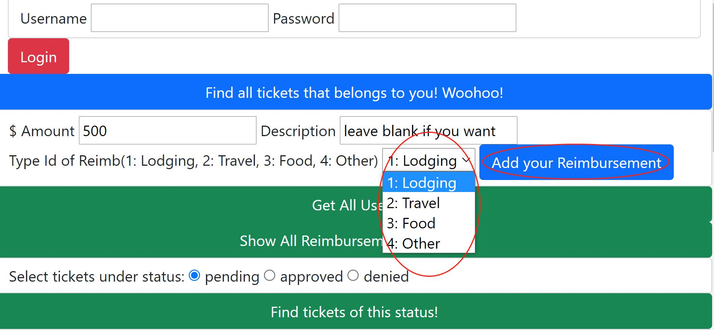
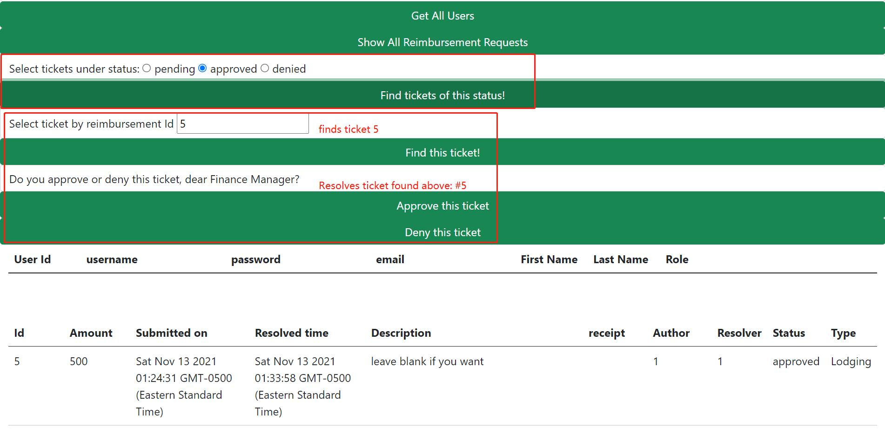
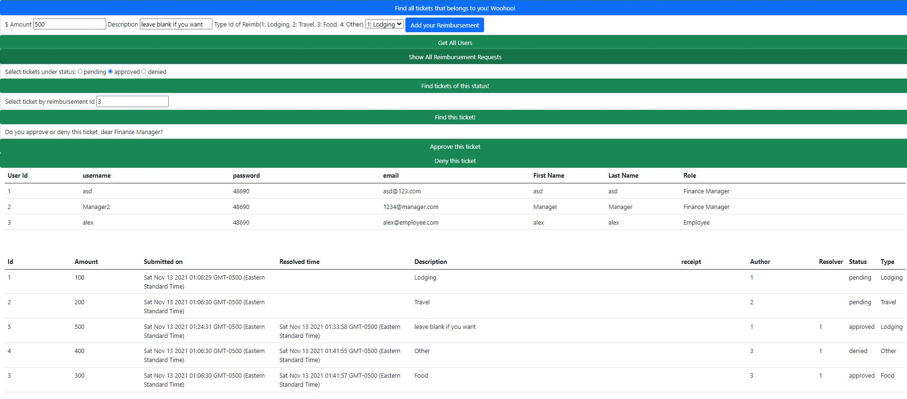

# Employee Reimbursement System (ERS)

## Project Description
The Expense Reimbursement System (ERS) manages the process of reimbursing employees for expenses incurred while on company time. All employees in the company can login and submit requests for reimbursement and view their past tickets and pending requests. Finance managers can log in and view all reimbursement requests and past history for all employees in the company. Finance managers are authorized to approve and deny requests for expense reimbursement.

**State-chart Diagram (Reimbursement Statuses)** 

**Reimbursement Types**

Employees must select the type of reimbursement as: LODGING, TRAVEL, FOOD, or OTHER.

**Logical Model**

**Physical Model**

**Use Case Diagram**

**Activity Diagram**

## Technologies Used
* Java 8
* Hibernate 5.6.1.Final
* JavaScript
* HTML 5
* PostgreSQL 42.2.24
* Javalin 3.13.12
* Jackson 2.13.0
* logback 1.2.6
* JUnit

**Features**
* The back-end system: Used Hibernate to connect to an AWS RDS Postgres database. 
* The middle tier: Javalin technology for dynamic Web application development. 
    * Follows proper 3-layered-DAO architecture
    * Have reasonable (>89%) test coverage of the service layer, and implement Logback for appropriate logging. 
* The front-end view: HTML/JavaScript. The application can call server-side components RESTfully. Passwords are encrypted in Java and securely stored in the database. 

**Stretch Goals**
* TODO: Replace HTML/JavaScript with an Angular single page application.
* TODO: Users can upload a document or image of their receipt when submitting reimbursements which can stored in the database and reviewed by a financial manager.
* TODO: Application shall be hosted remotely on an EC2.
* TODO: Static files (webpages) shall be hosted on an S3 bucket. 

**Getting Started**
* git clone https://github.com/210927-JavaFS/project1-albertlixw.git
* It runs on AWS, hence requires active AWS to run it. 

**Usage**
* Run app, go to http://localhost:8081/ERS.html
* Enter Username and password of a Finance Manager to test all the functions, as employees have limited functions. 
* Enter amount and select type of reimbursement from drop down list, and click "Add your Reimbursement" to submit a ticket. 

* If you're not a manager, click the top blue button to find all tickets that belongs to the user that just logged in. 

* Manager only functions: 

* * Get All Users and Show All Reimbursements can show all solvled and pending tickets of the past or present, and all registered users in the system. 
* * Find all tickets of a certain status from selected radio button. 
* * Enter ticketId, then find the ticket by its id. Then approve or deny the ticket found with a click of a button. 

<!-- **Contributors**
Me -->
<!-- 
**License**
None -->
